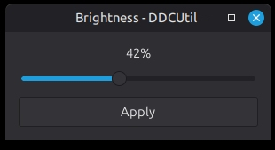

# 🖥️ Brightness GUI

A lightweight, modern GTK4 interface to control your monitor's hardware brightness using ddcutil. No more fiddling with physical monitor buttons or clunky OSD menus.



## ✨ Features
- Real-time Sync: Reads your monitor's actual hardware brightness level on startup.
- Modern UI: Built with GTK4, Blueprint, and Adwaita for a native, responsive Linux experience.
- Modern C++: Developed using C++17 and gtkmm-4.0 for a clean, type-safe, and maintainable codebase.
- Single Binary: Uses GResource to bundle the UI layout and assets directly into the executable—zero external UI files needed.
- Efficient: Minimal memory footprint and high performance.

## 🛠️ Prerequisites
Before building, ensure you have the following installed (tested on Linux Mint/Ubuntu):

```Bash
# Libraries and Development Headers
sudo apt install libgtkmm-4.0-dev ddcutil

# Build Tools
sudo apt install g++ make blueprint-compiler glib-compile-resources
```

Note: Your user must have permission to access I2C devices. If you encounter issues, run:
```Bash
sudo usermod -aG i2c $(whoami)
```

Then log out and log in for changes to take effect.

## 🚀 Building & Running
1. Development & Run
To compile with debug symbols and run immediately:

```Bash
make run
```

2. Release Build
To generate an optimized and stripped binary:

```Bash
make release
```

3. Cleanup
To remove build artifacts (obj/ folder and binary):

```Bash
make clean
```

## 🏗️ Project Structure
The project follows a clean separation of concerns:
- main.cpp: Application entry point.
- MainWindow.cpp / .hpp: Core UI logic and signal handling.
- monitor.cp / .hpp: Low-level hardware abstraction layer.
- window.blp: UI layout defined in Blueprint syntax.
- resources.gresource.xml: Manifest for bundling assets.
- obj/: Temporary build artifacts and generated files (ignored by Git).
- makefile: Automated build system

## 🛠️ Technical Details
This project implements modern GTK development standards:
- Leverages C++ for raw power and speed.
- gtkmm-4.0: Uses the official C++ wrapper for GTK4, ensuring better memory management and OOP patterns.
- Reactive UI: Signals and callbacks handle real-time synchronization between the slider and labels.
- Automated Pipeline: A custom Makefile orchestrates the compilation of Blueprint files into UI XML, then into C resources, before the final linking.
- IntelliSense Support: Compatible with compile_commands.json (via bear) for a red-squiggle-free development experience in VS Code.
